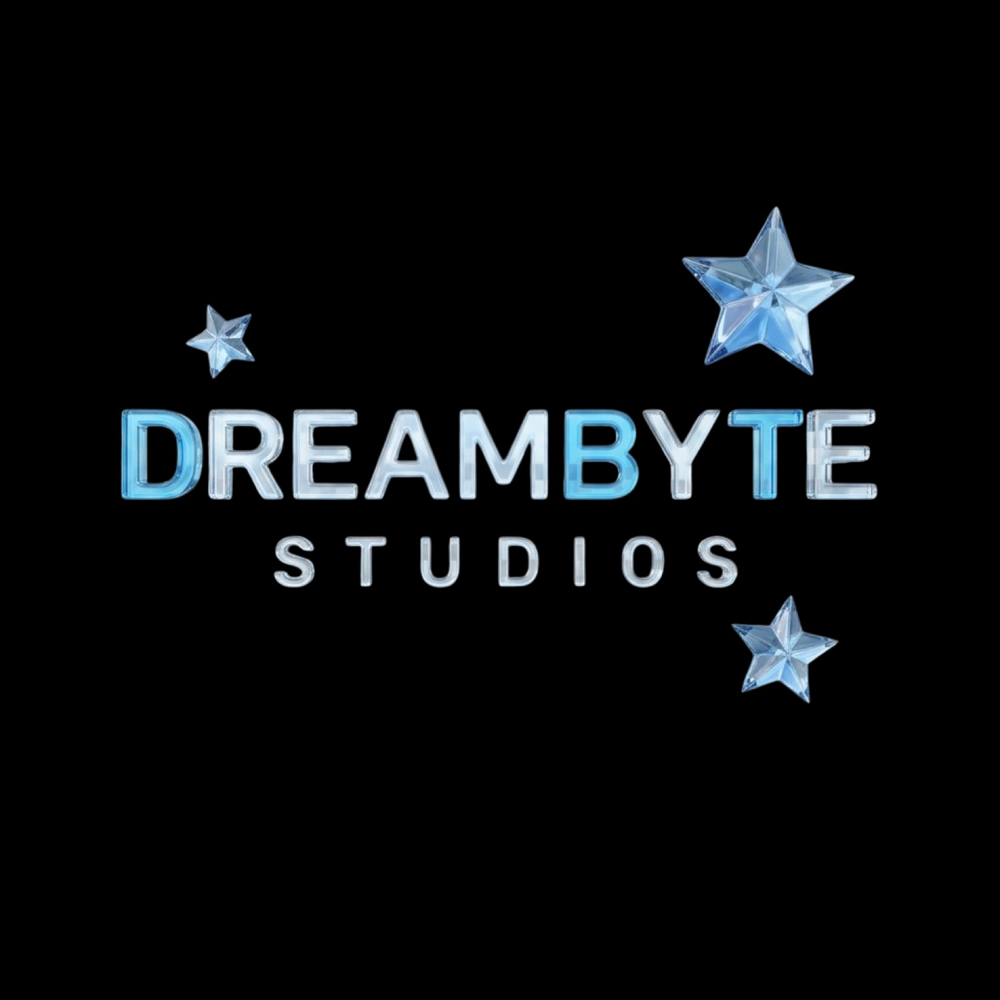
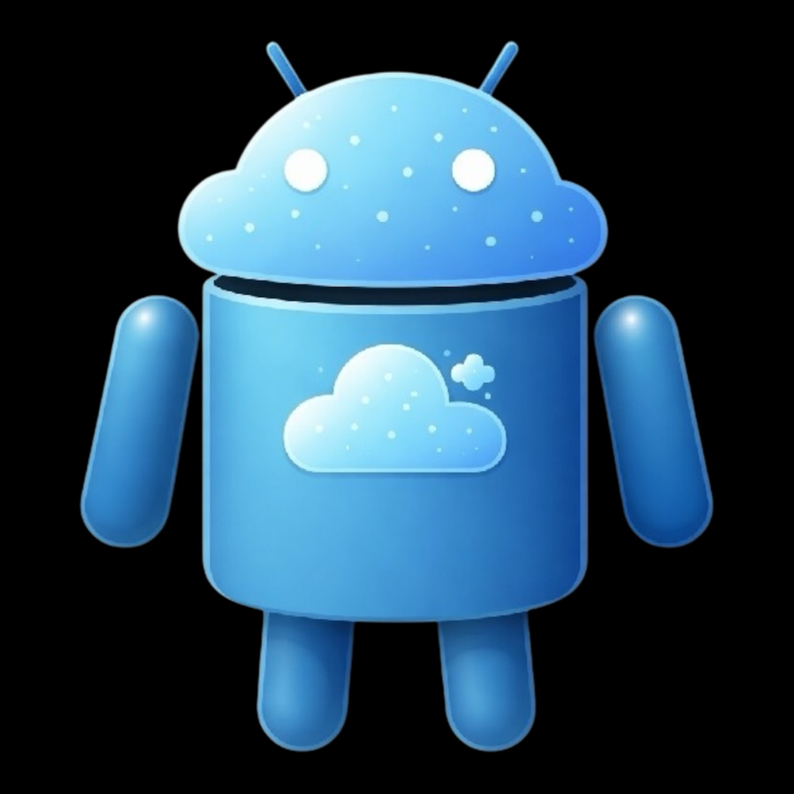

# 🌟 DreamByte Studios

**Animation Engine for AIs — Zero Cost • Unrestricted • Local-First • MCP Native**



> Turn any rigged 3D model (OBJ, GLB, FBX) into a fully animated character using natural language.  
> Built for AI agents. Powered by **DreamBot**.

---

### 🤖 Meet DreamBot
Official mascot of DreamByte Studios.



---

### ✨ Features

- **Text-to-Animation** for rigged 3D models
- Supports **OBJ / GLB / GLTF / FBX**
- **MCP native** — Claude, Cursor, Windsurf and any agent can use it
- **Liquid Glass** UI
- Completely **free & local** (no API costs)
- One AI inference per animation
- Live Three.js preview
- Cinematic intro on first load

---

### 🎥 Live Demo (Landing)

Open `public/index.html` in your browser.

The site plays our official intro (DreamBot + logo) and then shows the Liquid Glass landing.

---

### 🚀 Status

This is the foundation of DreamByte Studios.

**Next steps:**
- Full animation engine (inspired by the excellent open-source Animato)
- FastAPI backend + headless Blender
- Complete MCP server
- Editor UI with Liquid Glass

---

### 🛠️ Planned Tech Stack

- Frontend: React + Vite + Three.js + Liquid Glass design system
- Backend: FastAPI + bpy (Blender as Python module)
- MCP Server for AI agents
- Fully open source (MIT)

---

### 📁 Project Structure

```
DreamByte-Studios/
├── public/               # Landing + assets + intro video
│   ├── index.html
│   └── assets/
├── frontend/             # Future React editor
├── backend/              # Future FastAPI + animation engine
├── docs/
└── README.md
```

---

### ❤️ Credits

Inspired by the brilliant zero-cost design of [Animato](https://github.com/otdnnc/Animato).  
We are building on top of that idea with full branding, MCP support and Liquid Glass experience.

---

**DreamByte Studios**  
*Making animation accessible to every AI.*

© 2026 DreamByte Studios
